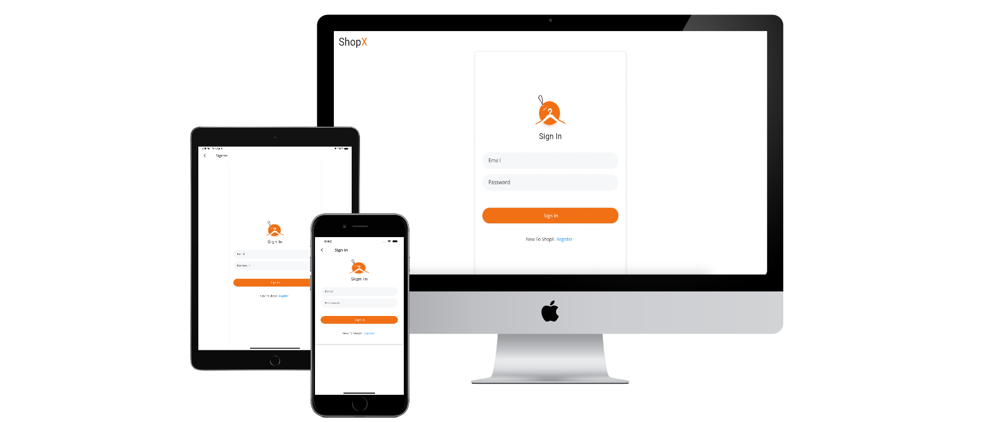
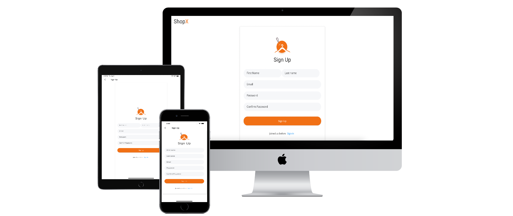
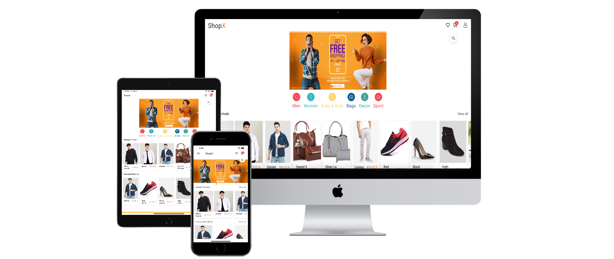
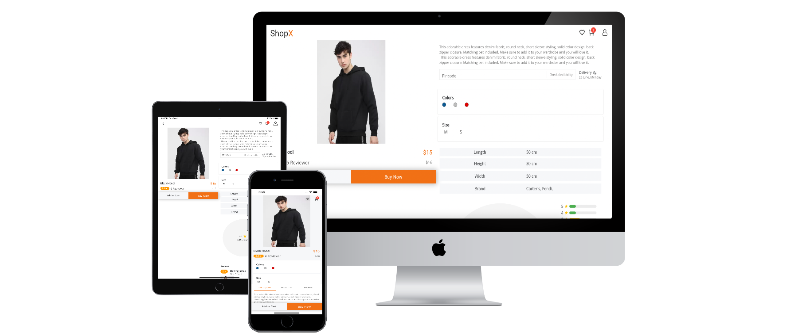
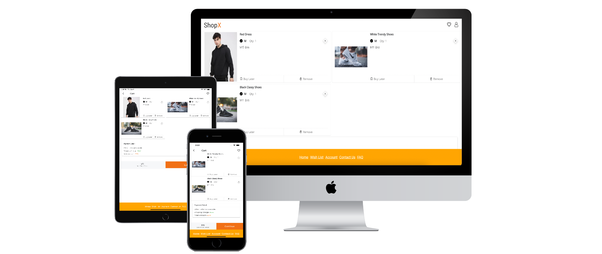
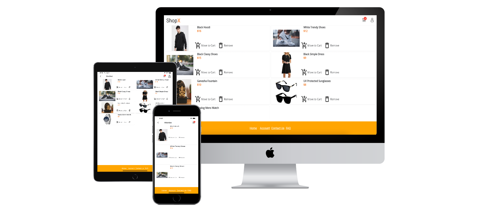
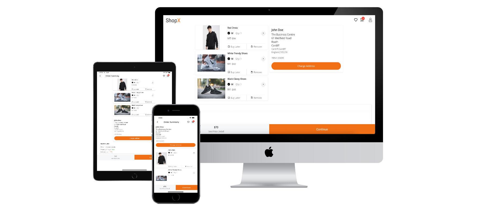
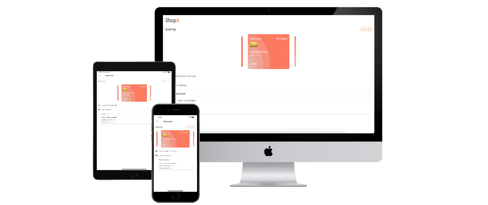
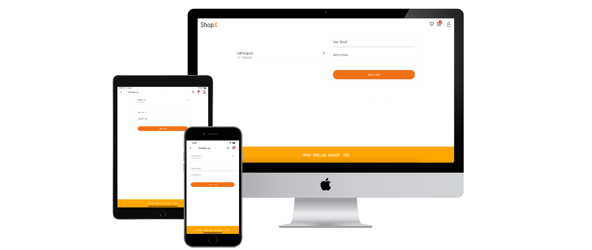

# E-Commerce App - Flutter Responsive UI for Mobile & Web

Simple e-commerce app made in. Flutter. The UI is made in a way that it is responsive to Mobile, Table and Desktop web. Screens line Home, Product detail, Profile, SignIn, SignUp, Wishlist and Cart are made responsive for multiple screen with single codebase. The data displayed in app is stored locally in json file for better experience. We use Get Routing feature from GetX library in order to route for both Mobile and Web platform. 

## Screenshot

• Sign-In

 

• Sign-Up

 

• Home

 

• Product detail

 

• Cart

 

• Wishlist

 

• Order Summary

 

• Payment

 

• Account/Setting

 

• Contact

 

• And few other screens also 👍.
